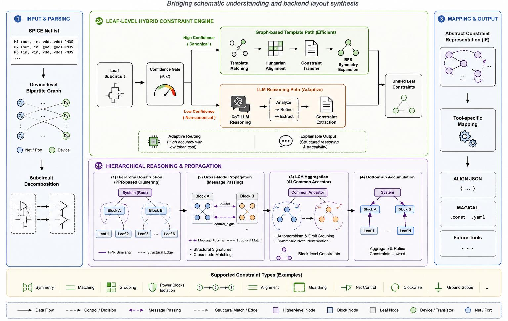

# AnaCLARA: A Hierarchical Reasoning-Driven Constraint Generation Framework for Analog Layout Synthesis

[](https://doi.org/10.1145/PLACEHOLDER)
[](LICENSE)
[](https://www.python.org/)
---

**AnaCLARA** is a circuit- and tool-agnostic, hierarchical reasoning-driven agentic framework that automatically generates multi-level layout constraints from SPICE netlists for analog/mixed-signal layout automation. It bridges front-end circuit understanding and back-end layout design by translating design intent into comprehensive, tool-specific constraints.

## Framework Overview



*Overall workflow of the AnaCLARA framework. The pipeline features an agentic, tool-agnostic core that consists of an adaptive leaf-level engine and a hierarchical propagation framework to generate multi-level layout constraints. The tool-specific mapping module then translates this design intent into actionable directives for layout synthesis.*


## Quick Start

```bash
# 1. Clone
git clone https://github.com/kaichangchen/AnaCLARA.git
cd AnaCLARA/Listen_to_the_HeaRT

# 2. Install
python -m venv venv
source venv/bin/activate  # Linux/Mac
pip install -r requirements.txt

# 3. Set API key (for LLM-assisted paths)
export NVIDIA_API_KEY="your-api-key-here"
```

## Repository Structure

```
AnaCLARA/
├── Listen_to_the_HeaRT/
│   ├── Expert_Leaf_Constraint_Engine/
│   │   ├── hybrid_constraint_engine.py   # Adaptive leaf-level engine
│   │   ├── parse_file.py                 # SPICE netlist parser
│   │   └── knowledge_base/              # 16-subcircuit KB templates (JSON)
│   ├── LLM_Agent_Codes/
│   │   ├── agents/
│   │   │   ├── base_agent.py            # LLM agent base class
│   │   │   ├── analytical_splitter_agent.py  # Subcircuit splitting agent
│   │   │   ├── hierarchy_agent.py       # Hierarchy construction agent
│   │   │   ├── system_level_structural_analysis_agent_Ablation.py
│   │   │   ├── prompts.py              # All LLM prompt templates
│   │   │   └── scoreboard.py           # F1 scoring utilities
│   │   ├── contexts/                    # Global/local context builders
│   │   ├── tools/                       # Function tools & JSON schemas
│   │   └── netlists/                    # Benchmark circuits + cached runs
│   │       ├── OTAs/ota1/              # Inverter-based OTA
│   │       ├── StrongArm_Latch_Comparator/
│   │       └── LDO_Simple/             # LDO regulator
│   └── requirements.txt
├── Baselines/
│   └── Kaichang_Generated_Constraints/  # Baseline comparison results
│       ├── scorer_baseline.py           # F1 evaluation script
│       ├── OTA_TOPOLOGY_1/
│       ├── StrongArm_Latch_Comparator/
│       └── LDO_Simple_Test_1/
└── README.md
```

## Usage

### Running the Adaptive Leaf-Level Constraint Engine

```python
from Expert_Leaf_Constraint_Engine.hybrid_constraint_engine import HybridConstraintEngine

engine = HybridConstraintEngine(
    model="GPT_BEST",          # or "CLAUDE_SONNET", "GEMINI_STABLE"
    kb_only_threshold=0.70,    # theta: confidence threshold
    complexity_cap=15,         # C: max devices for KB-only path
)

# Read a SPICE netlist
with open("LLM_Agent_Codes/netlists/OTAs/ota1/ota1.sp") as f:
    netlist = f.read()

# Generate constraints (variation=0: adaptive auto-gate)
result = engine.generate_constraints(netlist, variation=0)

# Output: ALIGN-compatible .const.json
print(result["constraints"])
```

### Running the Full Hierarchical Pipeline

```bash
# Run the splitter agent (subcircuit decomposition)
cd LLM_Agent_Codes
python agents/analytical_splitter_agent.py --netlist netlists/OTAs/ota1/ota1.sp

# Run hierarchy construction
python agents/hierarchy_agent.py --netlist netlists/OTAs/ota1/ota1.sp

# Run system-level structural analysis
python agents/system_level_structural_analysis_agent_Ablation.py \
    --netlist netlists/OTAs/ota1/ota1.sp
```

### Evaluating Results (F1 Scores)

```bash
# Compare generated constraints against expert ground truth
cd Baselines/Kaichang_Generated_Constraints
python scorer_baseline.py
```

## Configuration

| Parameter | Description | Default | Paper Reference |
|-----------|-------------|---------|-----------------|
| `kb_only_threshold` (theta) | Min similarity for KB-only path | 0.70 | Section 3.1, Algorithm 1 |
| `complexity_cap` (C) | Max device count for KB-only path | 15 | Section 3.1, Algorithm 1 |
| `variation` | LLM mode: 0=auto, 1=single-shot, 2=audit, 3=debate | 0 | Section 3.1 |
| `top_k` | Number of KB templates to match | 3 | -- |

## Supported LLM Backends

| Alias | Endpoint | Notes |
|-------|----------|-------|
| `GPT_BEST` | OpenAI GPT-5 | Primary (paper default) |
| `CLAUDE_SONNET` | Claude-4.5-Sonnet | Validated in Table 6 |
| `GEMINI_STABLE` | Gemini-2.5 Pro | Validated in Table 6 |

Switch between GPT-5.5, Claude Sonnet, Claude Opus, or Gemini Pro by editing `DEFAULT\_MODEL\_ENDPOINT` in  the `base\_agent.py` (line 21).

## Artifact Evaluation

This repository is the artifact for the MLCAD'26 paper. Two validation paths are supported:

**Full AnaCLARA Pipeline Rerun** (requires LLM API key)
```bash
cd Listen_to_the_HeaRT/LLM_Agent_Codes
source AnaCLARA_pipeline.csh <N_RUNS> <CASE>
```
where <N\_RUNS> is the number of independent runs and <CASE> is the circuit benchmark.

**Scorer Code** (does not require LLM API key)
```bash
python Baselines/Kaichang_Generated_Constraints/scorer_baseline.py
```
Expected results: F1_sym^dev = 1.000, F1_sym^net = 1.000, F1_matching = 0.983 (tolerance: +/-0.05 for LLM variability).

Results from past baseline runs are stored in the corresponding directories.

## Citation

```bibtex
@inproceedings{chen2026anaclara,
  title={AnaCLARA: A Hierarchical Reasoning-Driven Constraint Generation Framework for Analog Layout Synthesis},
  author={Chen, Kaichang and Poddar, Souradip and Gielen, Georges and Pan, David Z.},
  booktitle={ACM/IEEE International Symposium on Machine Learning for CAD (MLCAD)},
  year={2026},
  address={Jeju, South Korea}
}
```

## License

This project is licensed under the MIT License.

## Acknowledgments

This work has received funding from the European Research Council (ERC) under the European Union's Horizon 2020 research and innovation program (grant nᵒ101019982 - AnalogCreate), NSF under grant CCF-2112665, SRC under task 3160.007, Samsung, and an equipment donation from NVIDIA.
